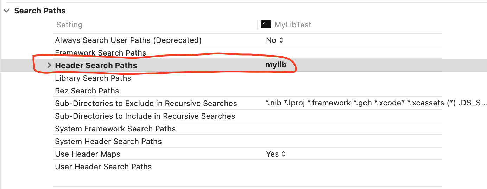

# Project-Adapt-Missing-Header
让自己的项目能无缝替代实现系统缺失的库头文件

 

当前随着软件的功能越来越复杂，我们所要动用的编程语言的新特性需求也愈来愈高，同时也会引入最新的知名第三方开源项目。而出于跨平台考虑，某些平台可能没法支持较高版本的编译器，亦或是缺失一些必要的标准库实现，因此我们可能需要对这些缺失的标准库做一些可无缝替代的实现。所谓“无缝替代”意味着——我们不需要修改原来业务逻辑的代码，哪怕是头文件包含也无需修改；而只是实现缺失库头文件的实现即可。

因此本项目的目的在于给大家一个很简单的demo以实现如何无缝替换缺失的系统库的实现。这里所引用的关键技术是GNU语法扩展所提供的 **`__has_include_next()`** 预处理文件是否可包含判定语法机制。使用此GNU语法扩展自带的宏函数用于判定指定的文件在当前能搜到它的搜索路径下的 **下一条** 搜索路径里是否存在指定的文件。言下之意，当我们使用 **`__has_include_next()`** 之后，预处理系统会先搜索到 **`()`** 中指定的文件之后，它会再去搜索第二个相同文件名的文件。只有找到了第二个文件，该宏函数才会返回1；否则返回0。

因此在我们实际项目工程中需要设置我们存放替换文件的路径作为默认的环境搜索路径。如果我们用的是Xcode话如下所示：

如果我们用命令行的话，直接使用 **`-Imylib`** 命令行编译选项即可。

 

虽然本项目基于macOS下进行测试，但也完全可以无缝移植到Linux上进行编译执行。

编译方法：首先进入 **`MyLibTest`** 目录。然后执行 **`sh build.sh`** 即可。最后会生成名为 **`test`** 的可执行文件。我们直接执行就能看到结果。

